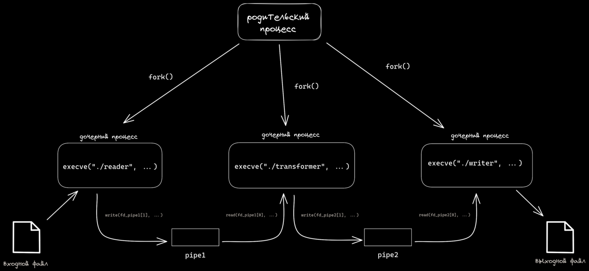
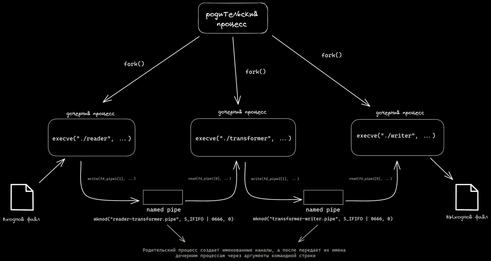
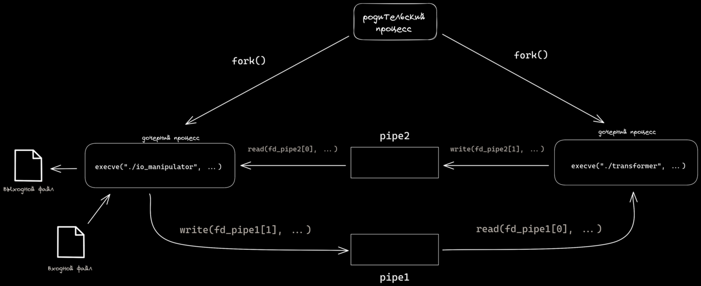

# ИДЗ №1

## Сафаров Сардор Хайрулла угли БПИ212

## Условие 18 варианта

Разработать программу, заменяющую все согласные буквы в заданной ASCII-строке на заглавные.

## Тестирование

### Набор тестов

Был составлен набор тестов для проверки работы программы на следующих входных данных:

1. Строка "Hello, World!"
2. Многострочный текст с различными разделителями (размер файла составляет более 5000 байт)
3. Многострочный текст, состоящий только из гласных букв
4. Строка, состоящая только из согласных букв различного регистра
5. Строка с разделителями, цифрами и строчными согласными буквами
6. Пустой файл
7. Случайно сгенерированная строка размером 7777 байт

Все тесты лежат в папке [input/](input/) и имеют в названии номер соответствующий списку выше.


### Результаты работы на тестовых файлах

Все результаты работы на тестовых файлах лежат в папке `~/output/` и имеют в названии номер, соответствующий списку выше. `~` &mdash; папка с программой на оценку в n баллов.

### Пример результата запуска скрипта

``` shell
chmod +x run.sh
./run.sh
```

## Сборка программ

Для сборки программ необходимо перейти в директорию с исходными кодами `~` и выполнить команду `make`

## Формат работы с программами

### Программы на оценку 4-7

``` shell
./program <filename_in> <filename_out>
```

`<filename_in>` &mdash; имя входного файла
`<filename_out>` &mdash; имя выходного файла

## Критерии на 4 балла

### Общая схема решаемой задачи



### Исходный код

Исходный код располагается в папке [4/](4/)

### Результаты работы

Написана программа, которая порождает 3 дочерних процесса. В свою очередь, каждый из дочерних процессов выполняет некоторый пользовательский сценарий: чтение из файла, обработка строки и замена в ней символов, запись в файл. Общение между дочерними процессами происходит через неименованные pipe. Каналы создаются и открываются родительским процессом, дочерние процессы получают дескрипторы через аргументы командной строки. Размер буфера составляет 5000 байт.

## Критерии на 5 баллов

### Общая схема решаемой задачи



### Исходный код

Исходный код располагается в папке [5/](5/)

### Результаты работы

Написана программа, логика работы которой такая же, как и у программы на оценку в 4 балла. За исключением того, что вместо дескрипторов дочерним процессам передаются имена каналов, через которые они будут взаимодействовать.

## Критерии на 6 баллов

### Общая схема решаемой задачи



### Исходный код

Исходный код располагается в папке [6/](6/)

### Результаты работы

Написана программа, в которой порождается 2 дочерних процесса. Устанавливается двухстороннее взаимодействие между этими двумя процессами посредством создания двух неименованных каналов.
